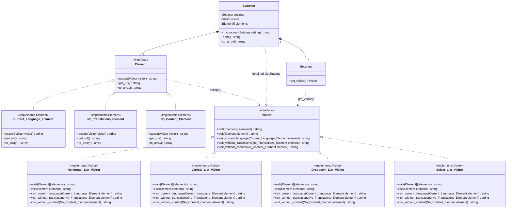
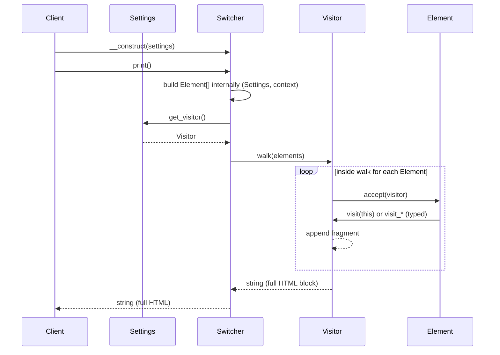
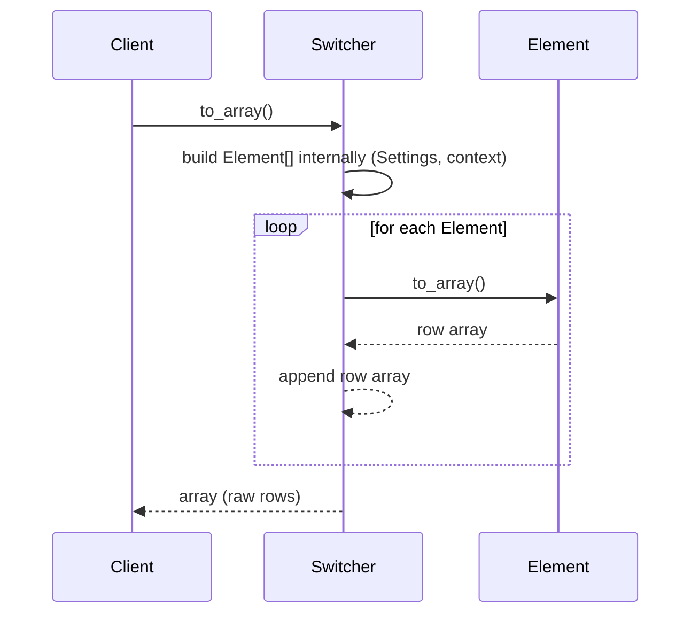

# Language switcher rendering architecture

UML below models a **Visitor-based** rendering pipeline: `Switcher` is the facade that owns configuration (`Settings`), **materializes** a list of `Element` instances internally (from `Settings` and runtime context), then fetches a concrete `Visitor` via `Settings::get_visitor()` for the desired presentation (horizontal list, vertical list, dropdown, `<select>`, ...). Presentation lives in visitor implementations. Rows are modeled as `Element` implementations: typed variants (`Current_Language_Element`, `No_Translations_Element`, `No_Content_Element`) dispatch to `visit_current_language`, `visit_without_translations`, or `visit_without_content`; a plain row uses the base `visit( Element )` contract. Each row exposes the URL via `get_url()`. The facade has two output entry points: `print()` returns a **string** (HTML/markup) through `Visitor::walk( Element[] )`, while `to_array()` returns the raw data structure matching the internal `Element[]`.

## Class diagram



Design notes:

- `Switcher` builds `Element[]` internally from `Settings` + runtime context, then calls `visitor.walk( elements )` in `print()` or `element->to_array()` in `to_array()`.
- `Settings` contains options / backward-compatibility adaptors and provides the concrete visitor through `get_visitor()`.
- `Element` is the row contract (`accept(Visitor)`, `get_url()`, `to_array()`). Typed implementations call `visit_current_language`, `visit_without_translations`, or `visit_without_content`; a plain `Element` calls `visit( Element )`.
- `Visitor::walk( Element[] elements )` loops rows; each `accept()` forwards to `visit( Element )` and/or the matching typed `visit_*` method.

## `walk()` on `Visitor`

`walk( elements )` receives the complete `Element[]` that `Switcher` built internally. The visitor owns the iteration: for each `Element`, it drives rendering via `element->accept( $this )`, which forwards either to the base `visit( Element )` (simple / non-discriminated row) or to a typed hook (`visit_current_language`, `visit_without_translations`, `visit_without_content`). It accumulates each row's `string` and returns one combined `string` for the whole switcher (opening/closing tags, separators, etc.). Different concrete visitors implement different `walk()` strategies (horizontal list shell vs `<select>` vs dropdown markup, etc.) while sharing the same per-row contracts.

## Element sub-types

All concrete element classes implement the `Element` interface.

| Element | Description |
|---------|-------------|
| **Current_Language_Element** | Represents the row for the currently active language. |
| **No_Translations_Element** | Represents a language row where translated content is unavailable. |
| **No_Content_Element** | Represents a row where the language link/content is empty or unavailable. |

Any other concrete `Element` (not one of the three above) is rendered through `Visitor::visit( Element )` from `accept(Visitor)`.

## Visitor sub-types

All concrete visitor classes implement the `Visitor` interface.

| Visitor | Description |
|---------|-------------|
| **Horizontal_List_Visitor** | Renders the switcher as a horizontal list (e.g. inline `<ul>` or row). Walks elements and emits left-to-right list chrome plus per-row output based on each typed `Element` variant. |
| **Vertical_List_Visitor** | Same data model as the horizontal visitor, but list markup and spacing target a stacked vertical block. |
| **Dropdown_List_Visitor** | Renders a dropdown or flyout (not a native `<select>`): toggle control, menu container, and items derived from each `Element`. |
| **Select_List_Visitor** | Renders a `<select>` (or equivalent): opening/closing `<select>`, `<option>` rows, and row state driven by typed `Element` variants plus `Settings`. |

## Print flow



Plain `Element` implementations call `visit( Element )`; typed classes call the corresponding `visit_*` method.

## `to_array()` flow



## Facade usage

Illustrative client code: build `Settings`, construct `Switcher` with it, then call either `print()` for HTML or `to_array()` for raw rows. `Element` rows are created inside the facade from `Settings` and request context; `Visitor` is fetched internally through `Settings::get_visitor()`.

```php
// Configuration: options, backward compatibility, adaptors.
$settings = new Settings( array( /*...*/ ) );

$switcher = new Switcher( $settings );

// Internally: build Element[] from $settings/context, get Visitor from $settings->get_visitor(), then $html = $visitor->walk( $elements ).
$html = $switcher->print();

return $html;
```

```php
$rows = $switcher->to_array();

return $rows; // Raw switcher data.
```

## Legend

| Concept | Role |
|--------|------|
| `Switcher` | Entry point: builds `Element[]` internally; in `print()`, fetches Visitor via `Settings::get_visitor()`, returns HTML through `Visitor::walk( elements )`; `to_array()` returns raw rows. |
| `Settings` | Options, backward compatibility, adaptors; exposes `get_visitor()` and global rendering rules. |
| `Element` | One row/language node with `accept(Visitor)`, `get_url()`, and `to_array()`. Concrete classes are `Current_Language_Element`, `No_Translations_Element`, `No_Content_Element`. |
| `Visitor` | Strategy per presentation; `walk( Element[] )` loops rows and assembles output via `visit( Element )` for plain rows and typed methods `visit_current_language`, `visit_without_translations`, `visit_without_content` where applicable. |
